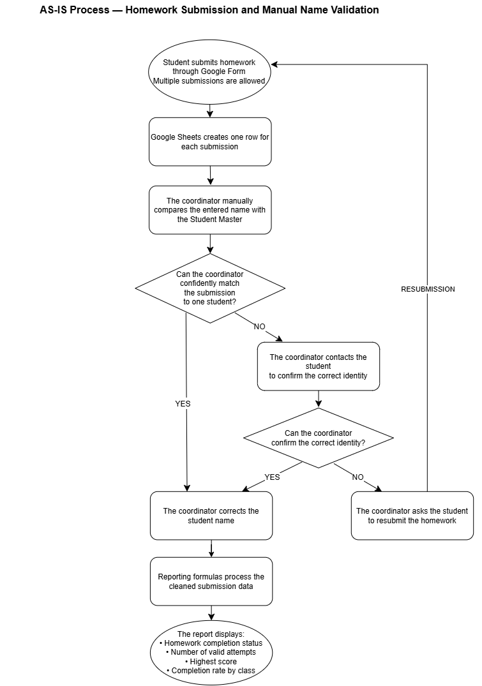
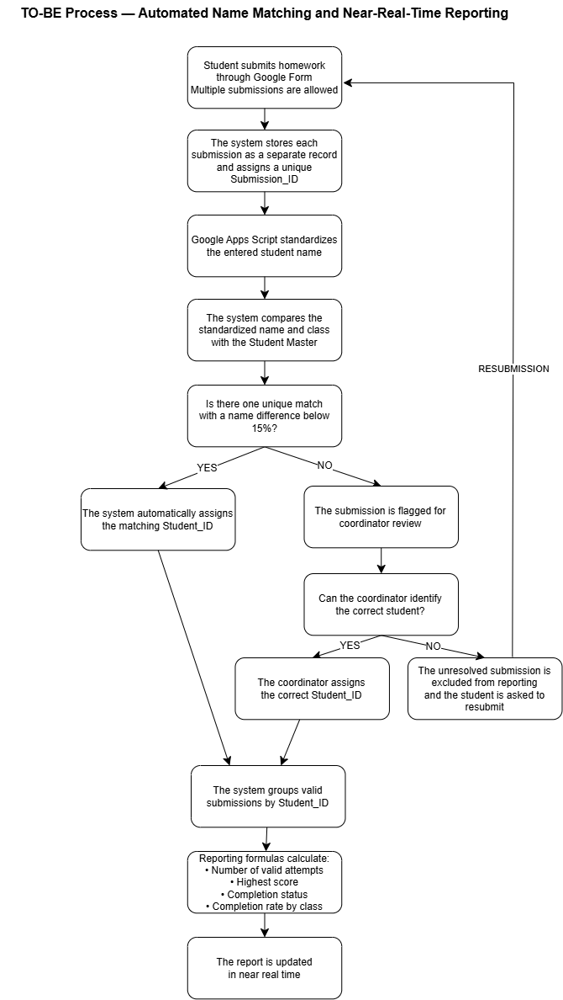

# Homework Submission Name Matching and Real-Time Reporting

## Project Overview

This case study documents an education operations workflow designed to standardize inconsistent student names while preserving every valid homework submission attempt.

## Business Problem

Students were allowed to submit homework multiple times. However, spelling mistakes and inconsistent name entries caused submissions from the same student to appear under different names.

The coordinator had to manually compare each submission with the Student Master before the reporting formulas could produce reliable results.

## Project Goal

Standardize student identities while preserving every valid submission attempt, enabling accurate reporting of:

- Homework completion status
- Number of valid attempts
- Highest score
- Completion rate by class

## Users

- Primary user: Education Coordinator
- Other users: Students, teachers and parents

## Tools

- Google Forms
- Google Sheets
- Google Apps Script
- diagrams.net

## AS-IS Process

Before automation, the coordinator manually checked and corrected inconsistent student names before the reporting formulas could process the submission data.

## TO-BE Process

Google Apps Script standardizes each entered name and compares it with the Student Master.

A unique match with a name difference below 15% is assigned the corresponding Student_ID. Ambiguous or uncertain matches are flagged for coordinator review.

Every submission is preserved so that the report can calculate the number of attempts and the highest score.

## Key Business Rules

- Students may submit homework multiple times.
- Every submission must be preserved.
- Reports must aggregate records by Student_ID rather than student name.
- Automatic matching is allowed only when one unique result is found and the name difference is below 15%.
- Ambiguous or uncertain results must be reviewed by the coordinator.
- Original Google Form responses must not be overwritten or deleted.

## Reporting Outputs

- Completion status by student
- Number of valid attempts
- Highest score
- Completion rate by class

## Business Impact

The solution was estimated to reduce up to eight hours of manual name checking per week and enabled reporting to update shortly after successful name matching.

The time-saving figure is based on retrospective operational experience because historical time-tracking records are not currently available.

## Data Privacy

This public case study uses fictional student data only. No real student names, contact information or confidential company data are included.

## Current Status

Documentation in progress. Test results, sanitized code and demonstration assets will be added in later project stages.
